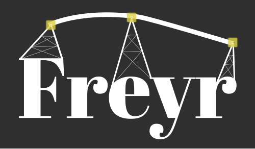
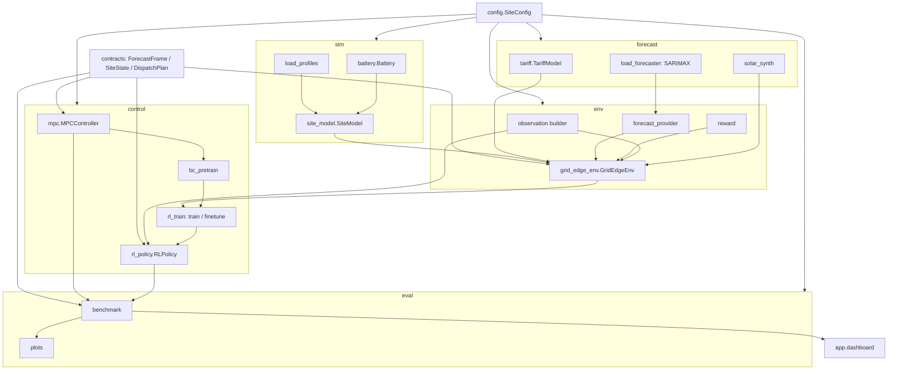

<div align="center">



</div>

# Freyr

A simulation-first grid-edge energy load-balancing system for a single commercial site with rooftop solar, battery storage, flexible loads, time-of-use (ToU) pricing, and a monthly demand charge. It ships a transparent optimization baseline (MPC) and a learned dispatch policy (PPO, warm-started from the MPC via behavior cloning).

## Tech Stack

### AI Models

MPC (Model-Predictive Control). At each control instant it solves a convex optimization for the next 24 hours using the forecast, applies only the first step, then re-solves after the horizon rolls forward. Splitting battery power into separate nonnegative charge/discharge variables keeps the problem convex (QP), so OSQP solves it fast and globally. It is transparent — every rupee in the objective is inspectable — which makes it the trustworthy baseline. Its weakness is that it is only as good as its forecast and its hand-written objective.

PPO (Proximal Policy Optimization). A policy-gradient RL algorithm. It collects rollouts in the simulator, estimates each action's advantage with GAE, and takes a clipped gradient step (bounded by a KL trust region) so updates never move the policy too far at once. Here gamma=0.998 is essential: the effective horizon must span multiple days so the agent credits "charge cheap now" against "discharge expensive later" — the core arbitrage. PPO's promise is a fast, forecast-free reactive policy at inference time; its risk is local optima.

BC (Behavior Cloning). Supervised imitation. We roll the oracle MPC to generate expert (obs, action) pairs, then train the PPO network by minimizing MSE between its predicted action mean and MPC's action. This seeds PPO near MPC-quality arbitrage instead of a cold start. (Note: only the action mean is cloned; since RLPolicy predicts deterministic=True, the untrained log-std is irrelevant at evaluation.)

Supporting techniques. SARIMAX with calendar exogenous features for load forecasting; clear-sky irradiance + AR(1) cloud process for synthetic solar; a convex running-maximum encoding of the monthly peak so early spikes can't dodge the demand charge; potential-based reward shaping (Ng et al.) available but off by default because a potential difference is provably policy-invariant (keeps the reported bill honest).

## Full Code Walkthrough
### 1. Glossary

| Abbrev. | Meaning in this project |
|---|---|
| **MPC** | Convex optimizer (`cvxpy`) that re-solves a rolling 24h dispatch plan. The transparent baseline. |
| **PPO** | Reinforcement-learning algorithm (Stable-Baselines3) behind the learned policy. |
| **BC** | Behavior Cloning — pretrains PPO to imitate MPC so it doesn't start from scratch. |
| **SoC** | Battery State of Charge (0.1–0.9 usable). |
| **ToU** | Time-of-Use electricity pricing (₹5 / ₹8 / ₹10 / ₹6 per kWh by hour block). |
| **kVA** | Demand (peak) charge unit, billed per kVA per month. |
| **SARIMAX** | Statistical model used to forecast site load for realistic (non-oracle) deployment. |
| **VecNormalize** | SB3 wrapper that standardizes PPO's observations using running mean/variance. |
| **HVAC / EV** | Two of the three flexible ("deferrable") loads, alongside water pumping. |


### 2. How It Works

1. Every component reads one `SiteConfig` and speaks two
shared data contracts (`ForecastFrame`, `SiteState`), so the tariff, battery,
and load assumptions never drift between the forecaster, simulator, and the
two controllers.

2. Synthetic 15-minute load and solar traces feed a physics
engine (`SiteModel`) that applies battery charge/discharge (with efficiency
and SoC limits), sheds flexible load when needed (booked as a real service
deficit, not a free saving), and computes grid import. A tariff model prices
each step and tracks the running monthly demand peak.

3. A shared observation builder feeds both training and
inference identically, so there's no train/inference drift. A forecast
provider supplies either the oracle future trace or a realistic SARIMAX
forecast. The reward is the negative bill plus shadow penalties (unmet load,
battery cycling, shedding) — but the project always **selects models by
actual measured bill, not by reward**, since the two can diverge.

4. MPC solves a fresh convex program every
few steps and applies only its first action (rolling horizon) — fully
transparent, but only as good as its forecast. PPO reacts instantly at
inference time with no solver call, but trained cold it collapses to "drain
the battery and never recharge," since discharging pays off immediately while
charging risks a demand-peak bump for a delayed reward. Behavior cloning (BC)
fixes this by pretraining PPO to imitate MPC's actions before any RL fine-tuning.
Both controllers emit the same `DispatchPlan` shape, so they're directly
comparable.

```
scenario (load, solar) ─▶ forecast_provider ─▶ observation builder ─▶ controller.solve
                                                                          │
                          ┌───────────────────────────────────────────────┤
                          ▼                                               ▼
                    MPCController (cvxpy)                          RLPolicy (PPO)
                          └───────────────► DispatchPlan ◄──────────────┘
                                                 │
                                     GridEdgeEnv / SiteModel.step  (physics)
                                                 │
                                        TariffModel.step  (money)
                                                 │
                                         metrics ─▶ benchmark / dashboard
```

**Module map:**



Data flows *up* from raw physics (`sim`) through the `env` wrapper into the
two controllers, which are compared in `eval` and surfaced in the `app`.


#### UI

1. Live Web Dashboard: An interactive web dashboard built using [plotly](https://github.com/plotly/plotly.py) and [streamlit](https://streamlit.io/)
2. Handheld TUI Module:
   
   a. Hardware: Raspberry Pi Zero W with a 3.5" display in a 3D printed housing.
   
   b. Software: A Terminal User Interface (TUI) built with Ratatui in Rust.

## FT Benchmark Statistics & Financial Model
> [!note]
> For details, see [docs/BENCHMARKS_AND_FINANCES.md](docs/BENCHMARKS_AND_FINANCES.md).
### 1. Per-seed benchmark (coagulated)

| Seed | Held-out | MPC bill | BC bill | FT bill | BC ratio | **FT ratio** | FT solar self-cons. | FT peak (kVA) | FT shed (kWh) |
|---:|:---:|---:|---:|---:|---:|---:|---:|---:|---:|
| 0 | no | 19,452 | 18,071 | 16,099 | 0.929 | **0.828** | 0.961 | 7.83 | 8.9 |
| 1 | **yes** | 21,470 | 18,404 | 16,663 | 0.857 | **0.776** | 0.966 | 8.28 | 9.0 |
| 2 | **yes** | 18,113 | 18,199 | 16,249 | 1.005 | **0.897** | 0.963 | 7.90 | 8.8 |
| 3 | no | 19,642 | 18,518 | 16,506 | 0.943 | **0.840** | 0.959 | 8.30 | 8.8 |
| 7 | **yes** | 19,395 | 18,269 | 16,325 | 0.942 | **0.842** | 0.956 | 7.86 | 8.8 |


### 2. Aggregate statistics

| Statistic | BC | **FT** |
|---|---:|---:|
| Mean bill ratio — all seeds | 0.9351 | **0.8366** |
| Mean bill ratio — held-out {1,2,7} | — | **0.8383** |
| **Savings vs MPC — all seeds** | 6.5% | **16.3%** |
| **Savings vs MPC — held-out** | — | **16.2%** |
| Best seed (largest saving) | — | seed 1 — 22.4% |
| Worst seed (smallest saving) | — | seed 2 — 10.3% |
| FT beats BC on every seed | — | **Yes** |
| Verdict vs ≥10% target | — | **PASS** |

### 3. Savings decomposition (per-site, monthly)

Using the seed-0 reference where the full MPC breakdown is known
(saving ₹3,515/month, 17.9%):

| Savings source | ₹/month | Share of saving | Mechanism |
|---|---:|---:|---|
| **Peak-shaving** (demand charge) | ≈2,332 | **≈66%** | Cut billing peak ~17.2 → ~7.8 kVA (≈9.3 kVA × ₹250) |
| **Energy arbitrage** (ToU) | ≈1,184 | **≈34%** | Charge in ₹5 block, discharge in ₹10 block; better solar self-use (0.96) |

Roughly **two-thirds of the value is demand-charge
reduction**, one-third energy arbitrage. Demand-charge savings scale directly with
the site's `₹/kVA/month` rate and are typically the stickier, larger line for C&I
customers.

