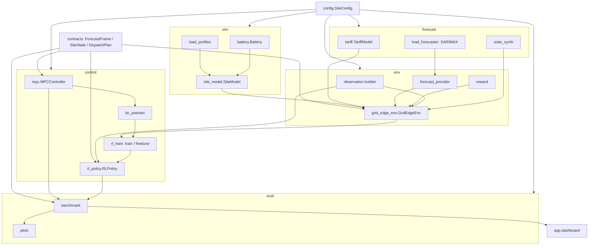

# ShriTeq GridEdge — Project Documentation

A simulation-first grid-edge energy load-balancing system for a single commercial
site with rooftop solar, battery storage, flexible loads, time-of-use (ToU)
pricing, and a monthly demand charge. It ships a transparent optimization
baseline (**MPC**) and a learned dispatch policy (**PPO**, warm-started from the
MPC via **behavior cloning**), and benchmarks the two on identical seeded
scenarios to report "the agent beats the baseline by X%" on the same billing
month.

---

## 1. Abbreviations & Glossary

| Abbrev. | Full term | Meaning in this project |
|---|---|---|
| **MPC** | Model-Predictive Control | Convex optimizer (`cvxpy`) that re-solves a rolling 24-hour dispatch plan every few steps. The transparent baseline controller. |
| **PPO** | Proximal Policy Optimization | The reinforcement-learning algorithm (from Stable-Baselines3) used to train the learned dispatch policy. |
| **RL** | Reinforcement Learning | Framework where an agent learns dispatch by maximizing cumulative reward through trial-and-error in the simulator. |
| **BC** | Behavior Cloning | Supervised imitation: the PPO network is trained to reproduce MPC's actions, giving PPO a good starting point instead of learning from scratch. |
| **FT** | Fine-Tune | The post-BC PPO pass. In practice its payoff came from re-fitting observation-normalization stats (see §2.ii), not from further policy learning. |
| **SoC** | State of Charge | Battery fill level as a fraction (0.1–0.9 usable here). |
| **ToU / ToD** | Time-of-Use / Time-of-Day | Electricity price that varies by hour block (₹5 / ₹8 / ₹10 / ₹6 per kWh). |
| **kVA** | Kilovolt-Ampere | Apparent-power unit used for the demand (peak) charge, billed per kVA per month. |
| **kW / kWh** | Kilowatt / Kilowatt-hour | Power / energy. Energy = power × time (here, 15-minute steps → ×0.25 h). |
| **SARIMAX** | Seasonal ARIMA with eXogenous regressors | The statistical time-series model (`statsmodels`) used to forecast site load. |
| **ARIMA / AR(1)** | Auto-Regressive Integrated Moving Average / first-order AR | The SARIMAX family; AR(1) also drives the synthetic cloud process for solar. |
| **GAE** | Generalized Advantage Estimation | Variance-reduction method PPO uses to estimate how good each action was (`gae_lambda=0.95`). |
| **KL** | Kullback–Leibler divergence | Distance between old and new policy; PPO uses a `target_kl` trust region to limit each update. |
| **VecNormalize** | Vectorized-env normalization | SB3 wrapper that standardizes observations (and rewards) using running mean/variance stats (`obs_rms`). |
| **OSQP / ECOS** | Convex solvers | Quadratic-program (OSQP) and conic (ECOS) solvers `cvxpy` calls for the MPC problem; ECOS is the conservative fallback. |
| **HVAC** | Heating, Ventilation & Air-Conditioning | One of three deferrable ("flexible") loads, alongside EV charging and water pumping. |
| **EV** | Electric Vehicle | Flexible charging load that can create a new monthly demand peak. |
| **`gamma` (γ)** | Discount factor | How far into the future PPO credits rewards (`0.998` ≈ multi-day horizon, needed for battery arbitrage). |
| **`ent_coef`** | Entropy coefficient | Encourages exploration; annealed to 0 for bill-aligned fine-tuning. |

---

## 2. Full Code Walkthrough

### 2.i. Control-flow guide (module by module)

The whole system is glued together by two shared data contracts in
`contracts.py` — `ForecastFrame` (one forecast row) and `SiteState` (current
conditions) — plus one shared `SiteConfig` (`config.py`) that every component
reads, so the tariff, battery, and load assumptions never drift between
forecaster, simulator, MPC, and RL.

**A. The simulation core (ground truth of physics + money)**

1. **`sim/load_profiles.generate_load_series`** and
   **`forecast/solar_synth.generate`** synthesize a 15-minute load and solar
   trace for a date range (solar via clear-sky irradiance × seasonal derate ×
   an AR(1) cloud process).
2. **`sim/battery.Battery.apply`** advances SoC given charge/discharge requests,
   enforcing power limits, SoC bounds (0.1–0.9), and one-way efficiency
   (`round_trip_efficiency ** 0.5` on each leg).
3. **`sim/site_model.SiteModel.step`** is the per-timestep physics engine. Given
   load, solar, battery commands, and the three flex fractions, it:
   computes flexible-load shedding (bounded by a per-day budget and a
   minimum-served-load floor), applies the battery, computes **grid import**
   (`net_load − solar − discharge + charge`), and returns a dict of energy,
   shed, SoC, and solar-use quantities. Deferred energy resets each simulated
   day. Crucially, shed load is booked as **unmet** — deferral is a real service
   deficit, not a free saving.
4. **`forecast/tariff.TariffModel.step`** returns the current ToU price and
   updates the running monthly billing peak. The demand charge is a **dense**
   signal: the instant grid import exceeds the running peak, `peak_bump_kva`
   is billed.

**B. The RL environment (wraps the core for training)**

5. **`env/observation.py`** is the single shared observation builder
   (`build_site_state_vector` → 12 features incl. cyclic time, SoC, peak
   headroom, remaining shed budget, price; `build_forecast_matrix` →
   `(horizon, 3)` of load/solar/price). Both the env and the policy adapter call
   it, so their observations are byte-identical.
6. **`env/forecast_provider.py`** supplies the horizon forecast. `SeriesForecastProvider`
   returns the actual future trace (oracle); `LoadForecasterProvider` substitutes
   a **SARIMAX** load forecast (realistic deployment). SARIMAX fits are
   `lru_cache`d per process.
7. **`env/reward.py`** turns one step's outcome into a scalar reward:
   `−energy_cost − demand_bump − unmet_penalty − cycle_penalty − deferred_penalty − shed_energy_penalty`.
   An optional potential-based shaping term is available but **off by default**
   (contributes exactly 0, keeping the reward bill-exact).
8. **`env/grid_edge_env.GridEdgeEnv`** is the `gymnasium.Env`. `reset()` picks a
   random 30-day window; `step(action)` maps the 4-dim `[-1,1]` action
   (battery + 3 flex fractions) into physical commands, calls `SiteModel.step`
   and `TariffModel.step`, computes reward, and returns the next observation.

**C. The two controllers**

9. **`control/mpc.MPCController.solve`** builds a convex program over a
   96-step (24 h) horizon: variables for grid import, battery charge/discharge,
   SoC, three flex loads, curtailment, a running-max `peak_kva`, and unmet load.
   Constraints enforce power balance, SoC dynamics, flex budgets, and
   `peak_kva ≥ import`. The objective minimizes energy cost + demand charge +
   battery wear + unmet/shed penalties. Solved with OSQP, falling back to ECOS;
   only the first step is applied (rolling horizon).
10. **`control/rl_policy.RLPolicy.solve`** loads a saved PPO model + its
    `VecNormalize` stats, builds the same observation via the shared builder,
    normalizes it, and calls `model.predict(deterministic=True)`. It returns a
    `DispatchPlan` in the exact same shape as MPC — so the two are drop-in
    comparable.

**D. Training pipeline**

11. **`control/bc_pretrain.py`** — (a) `collect_mpc_dataset` rolls the oracle MPC
    over several windows recording `(observation, action)` pairs;
    (b) `behavior_clone` supervised-trains the PPO policy network (MSE on the
    action mean) to imitate MPC, then saves `models/ppo_gridedge_bc.zip` + stats.
12. **`control/rl_train.py`** — `train()` runs standard PPO (γ=0.998,
    `EvalCallback` for best-model selection). `finetune()` continues from the BC
    checkpoint with a **critic warm-up** (`CriticWarmupCallback` freezes the
    actor while the value net catches up and, critically, while `VecNormalize`
    re-fits `obs_rms` to the *true* env distribution), and a `BillEvalCallback`
    that selects checkpoints by **actual bill** (not reward), floored at BC.

**E. Evaluation & presentation**

13. **`eval/benchmark.py`** — `run_benchmark` builds one seeded 30-day scenario,
    runs both `_run_mpc` and `_run_ppo` on it, and returns the metric dict
    (`total_bill`, `peak_kva`, `solar_self_consumption`, shed/unmet counts, …).
    `run_benchmark_with_traces` also returns per-step traces for plotting.
14. **`eval/plots.py`** — daily-dispatch, peak-shaving, cost-comparison, and
    forecast-vs-actual figures.
15. **`app/dashboard.py`** — Streamlit page: "Now" tiles, next-24h forecast +
    plan, and the benchmark table with `savings_pct` vs MPC. It renders whatever
    model is deployed at `models/ppo_gridedge.zip`.

**End-to-end runtime flow (deployment / benchmark):**
```
scenario (load, solar) ─▶ forecast_provider ─▶ observation builder ─▶ controller.solve
                                                                          │
                          ┌───────────────────────────────────────────────┤
                          ▼                                               ▼
                    MPCController (cvxpy)                          RLPolicy (PPO)
                          └───────────────► DispatchPlan ◄──────────────┘
                                                 │
                                     GridEdgeEnv / SiteModel.step  (physics)
                                                 │
                                        TariffModel.step  (money)
                                                 │
                                         metrics ─▶ benchmark / dashboard
```

### 2.ii. Techniques used

**MPC (Model-Predictive Control).** At each control instant it solves a convex
optimization for the next 24 hours using the forecast, applies only the *first*
step, then re-solves after the horizon rolls forward. Splitting battery power
into separate nonnegative charge/discharge variables keeps the problem convex
(QP), so OSQP solves it fast and globally. It is *transparent* — every rupee in
the objective is inspectable — which makes it the trustworthy baseline. Its
weakness is that it is only as good as its forecast and its hand-written
objective.

**PPO (Proximal Policy Optimization).** A policy-gradient RL algorithm. It
collects rollouts in the simulator, estimates each action's advantage with GAE,
and takes a *clipped* gradient step (bounded by a KL trust region) so updates
never move the policy too far at once. Here `gamma=0.998` is essential: the
effective horizon must span multiple days so the agent credits "charge cheap
now" against "discharge expensive later" — the core arbitrage. PPO's promise is
a fast, forecast-free reactive policy at inference time; its risk is local
optima.

**The never-charge local optimum (why BC exists).** Trained cold, PPO collapses
to "drain the battery, never recharge": discharging pays immediately while
charging costs energy *and* risks a demand-peak bump now for a delayed benefit.
Behavior cloning sidesteps this.

**BC (Behavior Cloning).** Supervised imitation. We roll the oracle MPC to
generate expert `(obs, action)` pairs, then train the PPO network by minimizing
MSE between its predicted action mean and MPC's action. This *seeds* PPO near
MPC-quality arbitrage instead of a cold start. (Note: only the action mean is
cloned; since `RLPolicy` predicts `deterministic=True`, the untrained log-std
is irrelevant at evaluation.)

**Reward ≠ bill.** The training reward nets out shadow penalties
(`unmet_penalty`, `cycle_penalty`, shed) that don't appear on the actual
electricity bill. A naive fine-tune can therefore "improve reward" while the
bill gets *worse*. This project selects checkpoints on the **measured bill**,
never on reward.

**The decisive lever — observation-normalization re-fit.** The largest
MPC-vs-learned gap turned out to be a normalization bug, not RL skill: BC froze
`VecNormalize.obs_rms` onto the *demonstration* distribution (oracle provider),
but deployment uses a different distribution (SARIMAX forecaster). Re-fitting
`obs_rms` to the true env — during a frozen-actor warm-up, same policy weights —
moved the deployed policy from ~6% to ~16% below MPC. Actor training *after* that
only drifted the bill back up. The shipped model is effectively "BC weights with
correctly-normalized inputs."

**Supporting techniques.** SARIMAX with calendar exogenous features for load
forecasting; clear-sky irradiance + AR(1) cloud process for synthetic solar; a
convex running-maximum encoding of the monthly peak so early spikes can't dodge
the demand charge; potential-based reward shaping (Ng et al.) available but off
by default because a potential *difference* is provably policy-invariant (keeps
the reported bill honest).

### 2.iii. Module structure graph



**Reading the graph:** `config` and `contracts` are the shared spine. Data flows
*up* from raw physics (`sim`) through the `env` wrapper into the two controllers,
which are compared in `eval` and surfaced in the `app`. The observation builder
is deliberately shared by both `grid_edge_env` and `rl_policy` to prevent
train/inference drift. Training is a chain: MPC → BC dataset → PPO/finetune →
saved model → RLPolicy.

---

## 3. Incorporating Finances into a Real-World Pitch

The simulator already emits the exact line items a customer's electricity bill
contains, which makes the financial story concrete rather than hand-wavy.

- **Lead with the same-scenario delta.** Report "agent beats baseline by X%" on
  *one* seeded billing month, decomposed into its two drivers:
  `total_energy_cost` (ToU arbitrage) and `demand_charge_incurred`
  (peak-shaving). These map one-to-one to the two charges on an Indian
  commercial power bill.
- **Annualize and show payback.** Multiply the monthly bill delta by 12, then
  divide the battery + controls capex by that annual saving to quote a
  **payback period** and a simple ROI / IRR. The oversized 100 kWh / 25 kW
  battery against a 3–12 kW load is precisely where the arbitrage headroom lives —
  frame it as "we monetize an asset you may already have."
- **Separate the two savings mechanisms** in the numbers, because they scale
  differently: energy arbitrage scales with the ToU spread (₹5→₹10 here);
  demand-charge savings scale with `₹250/kVA/month × peak reduction` and are
  often the *larger, stickier* line for commercial/industrial sites.
- **Quantify service quality as a guardrail, not a cost.** The pitch table
  already carries `unmet_load_kwh` / `shed_events` and a `service_quality_ok`
  flag — show that savings come with **no comfort regression** vs the baseline
  (a common objection).
- **Sensitivity band, not a point estimate.** Run the benchmark across several
  held-out seeds (weather/load variability) and quote a savings *range* with the
  worst case, which is far more credible to a CFO than a single lucky month.
- **Position MPC vs learned honestly.** MPC is the "auditable, deploy-today"
  baseline; the learned policy is the "cheaper-to-run at inference, no per-step
  solver" upgrade. Both beat do-nothing — sell the *system*, and let risk-averse
  buyers start on MPC.

Illustrative framing (fill with your actual benchmark numbers):
`monthly_saving = mpc_bill − agent_bill` → `annual = 12 × monthly_saving`
→ `payback_years = battery_capex / annual`.

---

## 4. Connecting to Real-World Scenarios

The system was built simulation-first specifically so the same contracts snap
onto real hardware and data with a thin adapter layer.

- **Swap synthetic data for metered feeds.** `generate_load_series` is the only
  synthetic source of load; in production replace it with the site's historical
  CSV/Parquet meter feed. Everything downstream (forecaster, env, controllers)
  already consumes a plain 15-minute `pandas.Series`.
- **Real forecasting is already the deployment path.** `LoadForecasterProvider`
  runs SARIMAX on recent history — the same code path used in
  `forecast_driven=True` benchmarks. For solar, `solar_synth` can be replaced by
  a `pvlib` clear-sky model driven by the site's actual lat/lon plus a weather
  feed (open-meteo / PVGIS) without touching the controllers.
- **Tariff configuration is data, not code.** `SiteConfig.tariff_blocks` and
  `demand_charge_inr_per_kva_month` are plain parameters — point them at the
  site's actual DISCOM tariff (ToU windows, demand rate, billing-cycle length)
  and the whole pipeline retargets.
- **The controller output is already a hardware setpoint.** A `DispatchPlan`
  (battery kW, HVAC/EV/pump fractions, grid import) is exactly what a BMS/EMS or
  inverter/BESS controller consumes. The rolling MPC re-solve cadence and the
  reactive PPO policy both fit a real 15-minute (or faster) dispatch loop.
- **Target customers.** Commercial & industrial sites on ToU + demand tariffs
  with on-site solar and/or storage: factories, malls, cold-storage, office
  campuses, EV-charging depots, and telecom/data sites — anywhere a monthly
  demand charge and price spread coexist.
- **Deployment posture.** Start in **shadow/advisory mode** (recommend setpoints,
  log would-be savings against the real bill) to earn trust, then move to
  closed-loop control. MPC's transparency is the natural on-ramp; the learned
  policy takes over once its shadow-mode savings are validated.
- **Honest caveats to carry into the field.** Results depend on forecast quality
  (real load is noisier than the synthetic trace); demand-charge savings assume
  the utility bills on a rolling/monthly peak as modeled; battery degradation is
  a simple wear term here and should be replaced with the vendor's real cycle-life
  model before quoting long-horizon ROI.
```
